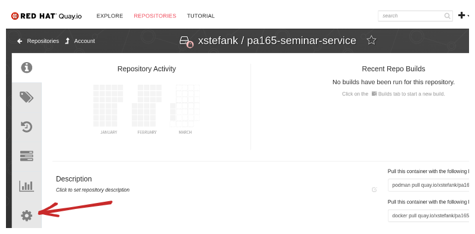
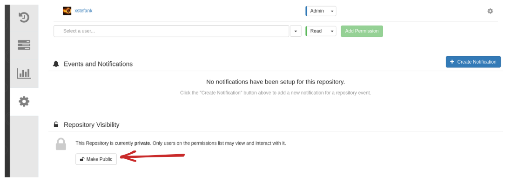
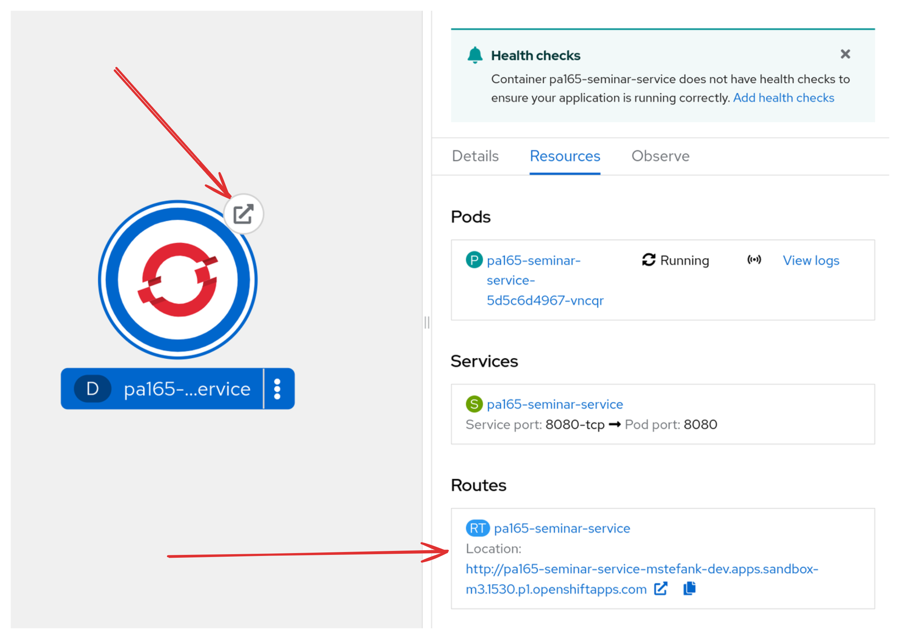
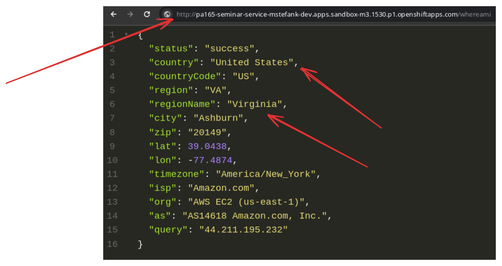
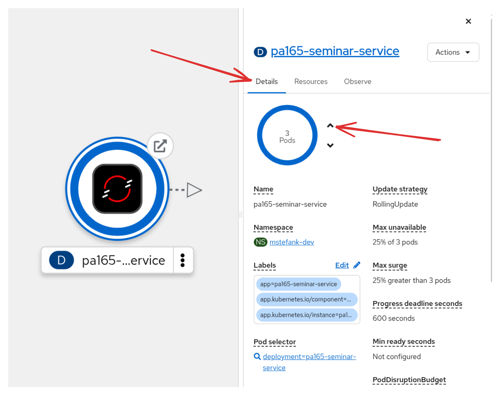
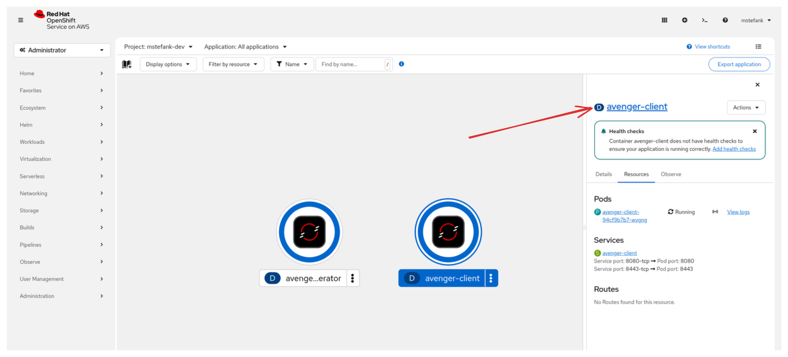

# Seminar 05 - Microservices

This seminar focuses on the use of containers in cloud environment. You'll learn about how to package your Quarkus application into an OCI image with Podman (You are also allowed to use Docker if it's something that you're already familiar with), 
how to run such image to get a running container, and also how to deploy such image to public registry (quay.io or Docker Hub) and how to consume it then locally on your machine as well as in public OpenShift (Kubernetes) cluster.

# Tasks

## Task 01 - Clone this repository

1. Clone this repository to your machine and open it in the Intellij IDEA.

## Task 02 - Investigate and run `pa165-seminar-service`

1. Investigate the code of the `pa165-seminar-service` application.

The class `WebResource` provides the same capabilities as the application demonstrated at the lecture:
- `GET /whereami` - returns a simple JSON containing information about the current location from where the request was created.
- `GET /whoami` - return a simple unique String that represents id of this application.

4. Build the application - `mvn clean package`
5. Run the application with `java -jar target/quarkus-app/quarkus-run.jar` and in different terminal try both endpoints:
   1. `curl localhost:8080/whereami`
   2. `curl localhost:8080/whoami`
6. In yet another terminal try to run the same application again while you leave the first one running. You will get an error because of port conflict on port 8080:

```shell
2026-02-16 16:15:07,914 ERROR [io.quarkus.runtime.Application] (main) Port 8080 seems to be in use by another process. Quarkus may already be running or the port is used by another application.
2026-02-16 16:15:07,924 WARN  [io.quarkus.runtime.Application] (main) Use 'ss -anop | grep 8080' or 'netstat -anop | grep 8080' to identify the process occupying the port.
2026-02-16 16:15:07,924 WARN  [io.quarkus.runtime.Application] (main) You can try to kill it with 'kill -9 <pid>'.
```

Which is of course correct because we can't have two applications running on the same port.

7. Run the second instance of the `pa165-seminar-service` on port 8081. Change the port only for the current execution of the application with:
   1. System property (`-Dquarkus.http.port`)
   2. Environment property (`QUARKUS_HTTP_PORT`)
   3. Compare the generated ids which should be different from the instance running on port 8080.
8. Run the `verify-task02` script (**UNIX**: `./verify-task02.sh` || **WINDOWS**: `.\verify-task02.ps1`) with both services running to verify this task.
9. Stop both instances of `pa165-seminar-service` (Ctrl+C).

## Task 03 - Packaging Podman OCI image

In this seminar, we use Podman (https://podman.io/) as our container runtime. If you are more used to Docker (https://www.docker.com/) feel free to use it. You can just replace all the calls to `podman` with `docker`.
   
1. Assuming that you still have a built `pa165-seminar-service` (if not, build it with `mvn clean package`), we can start creating Podman images. Verify that you have `podman` installed with:

```shell
$ podman version
Client:        Podman Engine
Version:       5.7.1
API Version:   5.7.1
Go Version:    go1.25.4 X:nodwarf5
Git Commit:    f845d14e941889ba4c071f35233d09b29d363c75
Built:         Wed Dec 10 01:00:00 2025
Build Origin:  Fedora Project
OS/Arch:       linux/amd64
```

You can use the latest available version.

3. Quarkus generates four Dockerfiles out of the box:

- `Dockerfile.jvm` - runs the application as `java -jar`
- `Dockerfile.legacy-jar` - older JAR format that also runs the application as `java -jar`
- `Dockerfile.native` - runs the application as GraalVM native binary
- `Dockerfile.native-micro` - also runs application as GraalVM native binary but also bases on very small image (for the applications where the image size matters)

For now, we can stick only to `Dockerfile.jvm` that contains everything we need. Check it's content. You can find the instruction how to package your application and how to use this Dockerfile to build an image in the comments. The actual content 
of the Dockerfile starts from line `FROM ...`:


- `FROM registry.access.redhat.com/ubi9/openjdk-21-runtime:1.24` - Each Dockerfile starts with FROM clause that defines the base image on top of which this image is created. We use `registry.access.redhat.com/ubi9/openjdk-21-runtime:1.24` which is a
version of the OpenJDK 21 image provided by Red Hat (as you can see from the registry it is being pulled from, i.e., the first part of the name until the first `/`).
- `COPY --chown=185 target/quarkus-app/*.jar /deployments/` (and other COPY statements) - this copies our created files to the image.
- `EXPOSE 8080` is just marking information that our application runs on port 8080 (used later in OpenShift).
- `USER 185` - changes the user id of the user we use inside the container.
- `ENV JAVA_APP_JAR="/deployments/quarkus-run.jar"` (and other ENV statements) - define environment properties we want to define in the container that runs from this image.
- `ENTRYPOINT [ "/opt/jboss/container/java/run/run-java.sh" ]` - The command that should be run when this image is run as container. Each Dockerfile should have and ENTRYPOINT or CMD clause that specifies the command. Search the internet what is 
  the difference between these two and when you would use which. This `run-java.sh` scripts comes from the base openjdk-21-runtime image.

4. Build the Podman image with the following commands:

```shell
$ podman pull registry.access.redhat.com/ubi9/openjdk-21-runtime:1.24 # this step is optional, base image is pulled automatically during the build
$ podman build -f src/main/docker/Dockerfile.jvm -t xstefank/pa165-seminar-service .
```

The `-f` parameter specifies the path to the Dockerfile. If not specified, Podman/Docker looks for the file named `Dockerfile` or `Containerfile` in the current directory.

The `-t` parameter represents the tag (name) under which the image is identified. Instead of `xstefank` use your faculty id.

**The important part** is the dot (`.`) at the end of the command that says that the source of the Podman image starts in the current directory.

If successful, you will see something similar to this in the terminal:

```shell
Successfully tagged localhost/xstefank/pa165-seminar-service:latest
47bb7c178c12eebe2807b64378b563933936f8a36433095c05a7e92c558850da
```

And you can verify that the image was created by:

```shell
$ podman images | grep pa165
localhost/xstefank/pa165-seminar-service  latest  5df83b0cf6fc  About a minute ago  419 MB
```

Windows:
```powershell
podman images | Select-String -Pattern "pa165"
localhost/xstefank/pa165-seminar-service  latest  5df83b0cf6fc  About a minute ago  419 MB
```

5. Run the verify-task03 script (**UNIX**: `./verify-task03.sh` || **WINDOWS**: `.\verify-task03.ps1`) to verify this task (run the script from root folder of the repository).

And now we are ready to run `pa165-seminar-service` in Podman container.

## Task 04 - Running the Podman container from the built image

1. In previous task we successfully created `localhost/xstefank/pa165-seminar-service` Podman image (of course, with your faculty name instead of `xstefank`).
2. To run this image as container all we need to is run the following command:

```shell
$ podman run -p 8080:8080 xstefank/pa165-seminar-service
INFO exec -a "java" java -XX:MaxRAMPercentage=80.0 -XX:+UseParallelGC -XX:MinHeapFreeRatio=10 -XX:MaxHeapFreeRatio=20 -XX:GCTimeRatio=4 -XX:AdaptiveSizePolicyWeight=90 -XX:+ExitOnOutOfMemoryError -Dquarkus.http.host=0.0.0.0 -Djava.util.logging.manager=org.jboss.logmanager.LogManager -cp "." -jar /deployments/quarkus-run.jar 
INFO running in /deployments
__  ____  __  _____   ___  __ ____  ______ 
 --/ __ \/ / / / _ | / _ \/ //_/ / / / __/ 
 -/ /_/ / /_/ / __ |/ , _/ ,< / /_/ /\ \   
--\___\_\____/_/ |_/_/|_/_/|_|\____/___/   
2026-02-16 16:30:06,627 INFO  [io.quarkus] (main) pa165-seminar-service 1.0.0-SNAPSHOT on JVM (powered by Quarkus 3.31.3) started in 0.520s. Listening on: http://0.0.0.0:8080
2026-02-16 16:30:06,628 INFO  [io.quarkus] (main) Profile prod activated. 
2026-02-16 16:30:06,628 INFO  [io.quarkus] (main) Installed features: [cdi, rest, rest-client, rest-jackson, smallrye-context-propagation, vertx]
```

_Note:_
- you can run docker images with parameter `-d` (Detached)
  - it will run the image in the background and allows you to continue using the terminal  
  - [Official Documentation](https://docs.docker.com/engine/reference/run/#detached--d)

Note that `localhost/` prefix can be omitted for the local images. Meaning `xstefank/pa165-seminar-service` == `localhost/xstefank/pa165-seminar-service`.

And now you have your Quarkus application running in Podman container!

To verify running containers you can use (in different terminal): 

```shell
$ podman ps
CONTAINER ID  IMAGE  COMMAND  CREATED  STATUS  PORTS  NAMES
b922fdf8e0e8  localhost/xstefank/pa165-seminar-service:latest  About a minute ago  Up About a minute  0.0.0.0:8080->80809/tcp, 8443/tcp  nifty_chaum
```

The `-p 8080:8080` parameter defines an HTTP tunnelling from your `localhost:8080` to the `:8080` port inside the container. This is required if we want to call the HTTP API in the container since each container runs by default in its own network which is not accessible from outside if not explicitly said so. This allows us to call the service as if it would be running on the localhost:8080 which is the same as if we would run it directly (without podman):
   - `curl localhost:8080/whereami`
   - `curl localhost:8080/whoami`

And now you have the running Podman container!

Stop the container with `Ctrl+C` in the terminal before the next step.

3. Run again the application two times, but this time in the containers. Once on port 8080 and once on port 8081. Don't change the `xstefank/pa165-seminar-service` image. Just run the image two times on different ports. 

4. Run the `verify-task04` script (**UNIX**: `./verify-task04.sh` || **WINDOWS**: `.\verify-task04.ps1`) with both services running to verify this task.


## Task 05 - Docker (podman) compose

`docker-compose` or in our case `podman-compose` is a declarative way to specify number of containers together with their configuration in a YAML format. They then correspond to a unit that can be managed together.

1. If you are working on the faculty PCs, you need to install the `podman-compose` binary manually with pip3 like this:

```shell
pip3 install podman-compose
```

Orherwise, please check https://github.com/containers/podman-compose#installation.

2. Verify that you have `podman-compose installed`:

```shell
$ podman-compose version
podman-compose version 1.5.0
podman version 5.7.1
```

NOTE: It was reported that on B130 computers the `~/.local/bin` is not on your `PATH` variable. To fix this, either add it to `PATH` with `export PATH=$PATH:~/.local/bin` or use the full path to the podman-compose in commands like this `~/.local/bin/podman-compose up`.

3. Create a new file `pa165-seminar-service/docker-compose.yaml`:

```yaml
---
version: '3'
services:
  web:
    image: xstefank/pa165-seminar-service
    ports:
      - "8080:8080"
  web2:
    image: xstefank/pa165-seminar-service
    ports:
      - "8081:8080"
```

This `docker-compose.yaml` defines our created image to be started in the two instances in the same way as you did it in the task 04 manually. Remember to change the `xstefank` to your user id.

4. Working with Docker/Podman compose.

To start containers as defined by the Docker/Podman compose configuration you can run in the directory where is the `docker-compose.yaml` file:

```shell
podman-compose up
```

In the log you will see that the two containers are started. You can verify that there are indeed two containers by running this in a different terminal:

```shell
$ podman ps
CONTAINER ID  IMAGE  COMMAND  CREATED  STATUS  PORTS  NAMES
d8f1b9e6fe76  localhost/xstefank/pa165-seminar-service:latest              17 seconds ago  Up 17 seconds  0.0.0.0:8080->8080/tcp, 8443/tcp  seminar-05_web_1
432db5f38674  localhost/xstefank/pa165-seminar-service:latest              17 seconds ago  Up 17 seconds  0.0.0.0:8081->8080/tcp, 8443/tcp  seminar-05_web2_1
```

_Possible problems:_
- `Bind for 0.0.0.0:8081 failed: port is already allocated`
  - Make sure that you have stopped previously run images so you have both 8080 and 8081 ports free.


And you can also run again `verify-task04` script since we have exactly same setup now as in task 04, just automated.

To stop the running containers, just pres `Ctrl+C` in the terminal where they run. Both containers are stopped.

5. Running podman-compose containers in background.

Above is sufficient from the usability view, but reading docs of for instance 10 containers overwriting each other is problematic. For that reason, it's useful to run all containers in the background and just view the logs of the relevant containers when they are needed.

To start containers in detached mode, start the podman-compse like this:

```shell
podman-compose up -d
```

You see that after the containers start, the command exits, and you again can work in the same terminal. Try again `podman ps` to verify that the containers are indeed running. Also, optionally run the `verify-task04` script if you'd like.

```shell
$ podman ps
CONTAINER ID  IMAGE  COMMAND  CREATED  STATUS  PORTS  NAMES
d8f1b9e6fe76  localhost/xstefank/pa165-seminar-service:latest              2 minutes ago  Up 21 seconds  0.0.0.0:8080->8080/tcp, 8443/tcp  seminar-05_web_1
432db5f38674  localhost/xstefank/pa165-seminar-service:latest              2 minutes ago  Up 21 seconds  0.0.0.0:8081->8080/tcp, 8443/tcp  seminar-05_web2_1
```

To view the logs of the containers we need to use either the container name (last column) or the container hash id (first column). The `-f` flag means follow, meaning that if there will be any more logs printed they will be forwarded to this output.

```shell
$ $ podman logs -f seminar-05_web_1
INFO exec -a "java" java -XX:MaxRAMPercentage=80.0 -XX:+UseParallelGC -XX:MinHeapFreeRatio=10 -XX:MaxHeapFreeRatio=20 -XX:GCTimeRatio=4 -XX:AdaptiveSizePolicyWeight=90 -XX:+ExitOnOutOfMemoryError -Dquarkus.http.host=0.0.0.0 -Djava.util.logging.manager=org.jboss.logmanager.LogManager -cp "." -jar /deployments/quarkus-run.jar 
INFO running in /deployments
__  ____  __  _____   ___  __ ____  ______ 
 --/ __ \/ / / / _ | / _ \/ //_/ / / / __/ 
 -/ /_/ / /_/ / __ |/ , _/ ,< / /_/ /\ \   
--\___\_\____/_/ |_/_/|_/_/|_|\____/___/   
2026-02-17 08:56:43,274 INFO  [io.quarkus] (main) pa165-seminar-service 1.0.0-SNAPSHOT on JVM (powered by Quarkus 3.31.3) started in 0.774s. Listening on: http://0.0.0.0:8080
```

To stop all containers running in the background which are defined in the configuration (again in the same directory as `docker-compose.yaml`):

```shell
podman-compose down
```

Note that the detached containers are not tight in any way to the current terminal (shell). The yaml config is parsed again when the `down` operation is invoked. So you can manage the containers in an easy automated way with this.

6. Add another image declaration to the `docker-compose.yaml` configuration. Use the image `quay.io/xstefank/pa165-test-image-quarkus` on port 8082 (mapped to 8080 in container). **This time, use really this exact image** from tutors `xstefank` 
   account. Start the podman-compose and verify that you have three services running. 

7. Verify that the task is implemented correctly with `./verify-task05` script (**UNIX**: `./verify-task05.sh` || **WINDOWS**: `.\verify-task05.ps1`).

## Task 06 - Pushing images to quay.io

quay.io (https://quay.io/) is a public Podman (Docker) registry. This means that is basically a place where we can publicly store and expose podman images for anyone to use. Another popular choice is Docker Hub registry (https://hub.docker.com/). Images are pushed to quay.io and can then be pulled from it. This is similar to how Maven handles distribution of dependencies that are being published to Maven repositories.

1. First, try to pull an image from the quay.io. Run the following command in terminal:

```shell
podman pull quay.io/podman/hello
```

- `quay.io` part is the name of the registry (another example would be `docker.io`)
- `podman` part is the name of the user or organization that published this image
- `hello` is the name of the image

This is the same as we had with `localhost/xstefank/pa165-seminar-service`. Again with your name instead of `xstefank`.

This pulls the `podman/hello` image from quay.io.

2. Verify that you have it now in your local registry with:

```shell
$ `podman image ls | grep podman/hello`
quay.io/podman/hello  latest  804953f8be6e  45 hours ago   82.3 kB
```

Windows:
```powershell
podman images | Select-String -Pattern "podman/hello"
quay.io/podman/hello  latest  804953f8be6e  45 hours ago   82.3 kB
```

3. Run the pulled image:

```shell
$ podman run quay.io/podman/hello
```

And now you have run an image that was built on someone else's computer.

4. The image will also be pulled when you try to run a container based on the image that you don't have in your local registry. 
In that case, the image will be pulled from remote registry like quay.io or Docker Hub. 
If the image is available in multiple registries, podman will let you choose which one you want (docker might not). 
Run the following command, and choose docker.io version of the postgres image:

```shell
podman run -p 8080:8080 xstefank/quarkus-petclinic
```

This time we pulled an image from Docker Hub (different registry) and you have a Quarkus PetClinic running on port 8080. Open http://localhost:8080 in your browser to verify that it is running.

Now it's time to start pushing our own images to remote registries.

5. Log in into https://quay.io/. I suggest using the same name as your faculty id if you're creating new account.
   - If you don't already have a Red Hat account, please create one. It's free and required for us to work with public registries and later free OpenShift instance.
   - You can also use Docker Hub if you have a Docker account. But if you need to choose, I suggest using https://quay.io/ because then you can reuse the Red Hat account for OpenShift later.

6. Verify that you have the image from task 04 available:

```shell
$ podman image ls | grep pa165-seminar-service
localhost/xstefank/pa165-seminar-service  latest  5df83b0cf6fc  20 hours ago  419 MB
```

Windows:
```powershell
podman image ls | Select-String -Pattern "pa165-seminar-service"
localhost/xstefank/pa165-seminar-service  latest  5df83b0cf6fc  20 hours ago  419 MB
```

`xstefank` is also tutor's username on quay.io. Replace all references from now on to your quay.io username.

7. Log in into quay.io with `podman` in your terminal:

```shell
podman login quay.io
```

You can also copy the login command with encrypted password from the Account Settings at quay.io.

8. Tag the `localhost/xstefank/pa165-seminar-service` into `quay.io/xstefank/pa165-seminar-service`. Use your username instead of `xstefank`. This must be aligned with you quay.io username! This is required if we want to push the image to the quay.io. The tag command will just assign a new name to the same image.

```shell
podman tag xstefank/pa165-seminar-service quay.io/xstefank/pa165-seminar-service
```

9. Verify that you have now two tags for the same image:

```shell
$ podman image ls | grep pa165-seminar-service
quay.io/xstefank/pa165-seminar-service  latest  5df83b0cf6fc  20 hours ago  419 MB
localhost/xstefank/pa165-seminar-service  latest  5df83b0cf6fc  20 hours ago  419 MB
```

Windows:
```powershell
podman image ls | Select-String -Pattern "pa165-seminar-service"
quay.io/xstefank/pa165-seminar-service  latest  5df83b0cf6fc  20 hours ago  419 MB
localhost/xstefank/pa165-seminar-service  latest  5df83b0cf6fc  20 hours ago  419 MB
```

You see that hashes are the same. So it's the same image with different tags.

10. Push the image to the quay.io registry with:

```shell
podman push quay.io/xstefank/pa165-seminar-service        
```

When successful, you can go to https://quay.io/repository/ and you should see your pushed image there.

NOTE: If the UI looks different for you, tick te slider at the top to "Current UI".

11. Make the image public by going into settings:



And clicking the `Make Public` button:



This is required for OpenShift later.

12. Run the verify-task06.sh with your quay.io username like this `./verify-task06.sh <username>` (e.g., `./verify-task06.sh xstefank`) to verify your tasks.

## Task 07 - Working with OpenShift

OpenShift (https://docs.openshift.com/) is a Red Hat maintained fork of Kubernetes (https://kubernetes.io/). For the basics that we need in this seminar, you can imagine it as an automation of containers management. You will say you want 5 instances of `pa165-seminar-service` running at all times and OpenShift will make sure to start 5 instances, and if any of it fails or stops, it will start a new one to always have 5 instances running.

For this seminar, we will use a free OpenShift cluster that you can get access to be having a Red Hat account (same as you would create for quay.io) called Developer Sandbox for Red Hat OpenShift (https://developers.redhat.com/developer-sandbox). It's a shared OpenShift instance in which you will have your own namespace (project) which is accessible only to you. This is limited to 14 GB RAM and 40 GB storage, and it will be available for 30 days. Additionally, all your pods (basically a container instance in OpenShift/Kubernetes) are scaled down to 0 after 12 hours. However, for the purposes of this seminar, but also the whole course and your projects it is more than sufficient. 

1. Create your OpenShift Sandbox at https://developers.redhat.com/developer-sandbox.
   - At https://developers.redhat.com/developer-sandbox click the `Start your sandbox for free` button.
   - If you already have a Red Hat account, you can use it. Otherwise, create a new account.
   - You might be asked to provide your number to verify your account with SMS. Author wasn't charged for this SMS.
   - If you are logged in, click `Start using your sandbox`.
   - In the Red Hat Hybrid Cloud Console click `Launch` button in the "Red Hat OpenShift box".
   - At Log in with... page click `DevSandbox` user which is the only option.
   - And you should be redirected to your openshift dashboard at the topology view at URL that looks similar to this `https://console-openshift-console.apps.sandbox-m3.1530.p1.openshiftapps.com/topology/ns/<your-username>-dev?view=graph` and looks like this:


And now you have your own OpenShift (meaning your own cloud) that runs somewhere in US (probably). 

In OpenShift, your application runs in a `Pod` which usually correspond to a container (but it can be multiple containers). Pod can be exposed for network access via a `Service` that makes it available for other pods in the same project. We can then expose the `Service` object via a `Route` object which exposes the pod even outside of your project, so it is possible to call it from anywhere. No need to go into specifics, but because we build the image with `EXPOSE 8080` OpenShift will already know to create a `Service` object that maps port 8080. However, we need to create the `Route` object manually.

2. Verify that you have the `oc` command line tool installed (it's ok if you don't):

```shell
$ oc
OpenShift Client

This client helps you develop, build, deploy, and run your applications on any
OpenShift or Kubernetes cluster. It also includes the administrative
commands for managing a cluster under the 'adm' subcommand.

Basic Commands:
  login             Log in to a server
  new-project       Request a new project
  new-app           Create a new application
...
```

If you are on a PC in the B130 room, add it to your PATH with:
```bash
$ module add openshift-client-4.12
```

If you don't have it available on your personal machine, you need to download it. Fortunately, every OpenShift instance
provides you with the precisely needed version of `oc` tool to download directly in the OpenShift console. 
Click the `?` button in the top right corner:


And download the `oc - OpenShift Command Line Interface (CLI)` for your particular system. 

If you didn't see `tar` file before, it's a zip like file that you can unzip with `tar xvf oc.tar`.

This is already an executable binary and you can verify it with `./oc version`. I suggest adding it into your `PATH` so it's accessible everywhere. Otherwise, you need to write the full path to the `oc` binary if you will be in different directories.

3. In the OpenShift console, click your username in the top right corner and click the `Copy login command` from the dropdown menu.


Log in again with the only available option `DevSandbox`.

Click `Display token` button.

And copy the login command under `Log in with this token` which looks like this:

`oc login --token=sha256~your-token --server=your-openshift-server`

And paste this into your terminal to log your client into your OpenShift.

```shell
$ oc login --token=sha256~hidden-token --server=https://api.sandbox-m3.1530.p1.openshiftapps.com:6443
Logged into "https://api.sandbox-m3.1530.p1.openshiftapps.com:6443" as "mstefank" using the token provided.

You have one project on this server: "mstefank-dev"

Using project "mstefank-dev".
```

Note that my Red Hat id is `mstefank` but in Quay.io I have `xstefank`.  

If you get something like `oc: command not found...` then you don't have correctly set `PATH` to the location where your `oc` tool is (e.g, `export PATH=$PATH /home/mstefank/Downloads` assumind the oc is in `/home/mstefank/Downloads/oc`) or just write the command with full path as `/home/mstefank/Downloads/oc login --token...`.

4. In the terminal where you logged into OpenShift, deploy the public version of your image to your OpenShift with:

```shell
oc new-app quay.io/xstefank/pa165-seminar-service
```

This prints something like this:

```shell
$ oc new-app quay.io/xstefank/pa165-seminar-service
--> Found container image e14a0dc (22 minutes old) from quay.io for "quay.io/xstefank/pa165-seminar-service"

    * An image stream tag will be created as "pa165-seminar-service:latest" that will track this image

--> Creating resources ...
    imagestream.image.openshift.io "pa165-seminar-service" created
    deployment.apps "pa165-seminar-service" created
    service "pa165-seminar-service" created
--> Success
    Application is not exposed. You can expose services to the outside world by executing one or more of the commands below:
     'oc expose service/pa165-seminar-service' 
    Run 'oc status' to view your app.
```

This created a bunch of resources, but the notable ones are:

- A deployment `pa165-seminar-service` which is a handler of the pods - rollouts/number of instances and similar. Either click the icon:


Or in the terminal:

```shell
$ oc get deployments
NAME                    READY   UP-TO-DATE   AVAILABLE   AGE
pa165-seminar-service   1/1     1            1           7m51s
```

- A pod `pa165-seminar-service-<sth>` that is the actual container that was run from our image. You can also see it in the `Topology` view if you click the deployment mentioned above:


Also viewable in the terminal with `oc get pods`:

```shell
$ oc get pods
NAME                                     READY   STATUS    RESTARTS   AGE
pa165-seminar-service-5d5c6d4967-vncqr   1/1     Running   0          12m
```

If you click the `View logs` button this will take to the logs from the running container of your application. In terminal, you can get that with `oc logs -f pa165-seminar-service-5d5c6d4967-vncqr`.

- A Service object called `pa165-seminar-service` which you can also see in the detail of the deployment above. This exposes the `pa165-seminar-service` deployment inside this cluster on port `8080` that is automatically parsed from our image (`EXPOSE 8080`). So if we would have different application deployed in this OpenShift cluster they would be already available to call this service from inside OpenShift.

Also in terminal you can get it with `oc get svc`:

```shell
$ oc get svc
NAME                    TYPE        CLUSTER-IP      EXTERNAL-IP   PORT(S)    AGE
pa165-seminar-service   ClusterIP   172.30.229.10   <none>        8080/TCP   14m
```

5. Expose the Route object for the deployed application. In order for us to be able to call our application from outside OpenShift, we need to expose a route for it. This is very easily done with `oc expose service/pa165-seminar-service`. This is also already hinted when you deploy the application and the Service object is created:

```shell
    service "pa165-seminar-service" created
--> Success
    Application is not exposed. You can expose services to the outside world by executing one or more of the commands below:
     'oc expose service/pa165-seminar-service' 
    Run 'oc status' to view your app.
```

Run:

```shell
$ oc expose service/pa165-seminar-service 
route.route.openshift.io/pa165-seminar-service exposed
```

And `oc get routes` to view your public URL:

```shell
$ oc get routes
NAME                    HOST/PORT                                                                      PATH   SERVICES                PORT       TERMINATION   WILDCARD
pa165-seminar-service   pa165-seminar-service-mstefank-dev.apps.sandbox-m3.1530.p1.openshiftapps.com          pa165-seminar-service   8080-tcp                 None
```

Also notice a new small icon in the top right corner of the deployment icon in the `Topology` view together with the `Routes` section in the detail:



These will take you to the public URL of your application. Just note that if click the icon in the deployment it'll take you to `https://` where our application doesn't run, so just change the URL to start with `http://` if this happens.

Of course, we don't have anything running on the root path `/` only on `/whereami` and `/whoami`. So just append one of these to the public URL and we're done. Invoke the `http://<your-route-url>/whereami` in your browser or in terminal with `curl`:



In the terminal you can get the same response by using the route instead of `localhost`:

```shell
$ curl http://pa165-seminar-service-mstefank-dev.apps.sandbox-m3.1530.p1.openshiftapps.com/whereami
```

And as you can see we indeed run the application that you built on your computer now somewhere in US. 

6. Scale the application to 3 instances. In the `Topology` view again click the detail of the deployment and in the `Details` tab click the up arrow 2 times to get three instances of `pa165-seminar-service` running. This means that you will have now three pods of this deployment running. You can view them in the `Resources` tab for instance or with `oc get pods` in terminal.



```shell
$ oc get pods
NAME                                     READY   STATUS    RESTARTS   AGE
pa165-seminar-service-5d5c6d4967-6rbvj   1/1     Running   0          100s
pa165-seminar-service-5d5c6d4967-dlpdb   1/1     Running   0          100s
pa165-seminar-service-5d5c6d4967-vncqr   1/1     Running   0          30m
```

7. Try to call your public URL now a few times again but this time on the `/whoami` endpoint. You will see that you automatically get a load balancer set up with the service that will redirect your calls to different pods:

```shell
$ curl http://pa165-seminar-service-mstefank-dev.apps.sandbox-m3.1530.p1.openshiftapps.com/whoami
Id: Web Server Node 689466e4-3966-4cbe-a6c9-e26dfefecc43% 
$ curl http://pa165-seminar-service-mstefank-dev.apps.sandbox-m3.1530.p1.openshiftapps.com/whoami
Id: Web Server Node 689466e4-3966-4cbe-a6c9-e26dfefecc43% 
$ curl http://pa165-seminar-service-mstefank-dev.apps.sandbox-m3.1530.p1.openshiftapps.com/whoami
Id: Web Server Node 4d367009-aa36-44ae-99f9-aa87e752e4c8%                           
$ curl http://pa165-seminar-service-mstefank-dev.apps.sandbox-m3.1530.p1.openshiftapps.com/whoami
Id: Web Server Node a9a9911f-77d6-4e78-9e09-b864e2d7636c%
```

It might happen that two consecutive calls will go to the same pod, so try a few more times in that case.

8. Verify your task with the script `verify-task07.sh <your-public-URL>`. You must run it with the public URL of your route where your application is accessible like this:

`$ ./verify-task07.sh http://pa165-seminar-service-mstefank-dev.apps.sandbox-m3.1530.p1.openshiftapps.com`

9. Optional: If you need to delete all the resources that you deployed to your OpenShift (total clean up) you can run `oc delete all --all`:

```shell
$ oc delete all --all
pod "pa165-seminar-service-5d5c6d4967-6rbvj" deleted
pod "pa165-seminar-service-5d5c6d4967-dlpdb" deleted
pod "pa165-seminar-service-5d5c6d4967-vncqr" deleted
service "pa165-seminar-service" deleted
deployment.apps "pa165-seminar-service" deleted
Warning: apps.openshift.io/v1 DeploymentConfig is deprecated in v4.14+, unavailable in v4.10000+
imagestream.image.openshift.io "pa165-seminar-service" deleted
route.route.openshift.io "pa165-seminar-service" deleted
```

## Optional: Task 08 - Avenger services

Your task here will now be to reproduce the whole seminar yourselves.

You will work with two new services:

- `avenger-generator` runs on port 8081
- `avenger-client` runs on port 8080

Throughout this task, **DON'T change the Java code of these projects**.

1. Build both service with `mvn clean package`. 

2. Run both services with uber JARs you built. Investigate the code to know which endpoints are available.

You aim for outputs like these:

```shell
# avenger-generator
{"name":"Falcon","civilName":"Generated","snapped":false}

# avenger-client
["!!! WRONG URL configured in your client service !!!","!!! WRONG URL configured in your client service !!!","!!! WRONG URL configured in your client service !!!"]
```

Verify the task with `./verify-task08-02.sh`.

3. As you can see, it seems we are calling wrong URL from `avenger-client` to `avenger-generator`. Fix it without changing any code in these services.

   1. Read about the `@Value` annotation - https://www.baeldung.com/spring-value-annotation
   2. Override the default value provided by configuration file with environment variable
      - Hint: `TARGET_SERVER_URL="..." java -jar ...`
   3. Override the default value with the system property.
      - Hint: `java -Dtarget.server.url="..." -jar ...`

Notice how the name of the injected value transforms per convention of environment variable names and system properties names. 

Optional: Only if you need a slight refresher on what are the environment variables (read https://www.geeksforgeeks.org/environment-variables-in-linux-unix/) or Java system properties (read https://howtodoinjava.com/java/basics/java-system-properties/).

The outputs should now work correctly and the output of `avenger-client` should be the list of generated avengers:

```shell
["{\"name\":\"America\",\"civilName\":\"Generated\",\"snapped\":true}","{\"name\":\"Iron Marvel\",\"civilName\":\"Generated\",\"snapped\":true}","{\"name\":\"Hulk Man\",\"civilName\":\"Generated\",\"snapped\":false}"]
```

Verify the task with `./verify-task08-03.sh`.

4. Add Dockerfile to both services based on the `eclipse-temurin:17-jdk-alpine`. It might be the same as we used before. Just change the `EXPOSE` line to correct port 8081 in generator and 8080 in client.

5. Build the images to your local registry (`<username>/avenger-generator` and `<username/avenger-client`)

6. Run the built Docker images, remember that one container should run on port 8080 and second on port 8081.

The port forwarding with `-p 8080:8080` won't work with this setup. You need to run (at least the client, but you can run both) in the `host` podman network which will basically run them as if you would run them directly on your machine. Replace all `-p port:port` in your `podman run` commands with `--network host`. For instance:

```shell
podman run --network host xstefank/avenger-client
```

Verify the task with `./verify-task08-06.sh`.

7. Again, the WRONG URL is configured and now also baked into the image of `avenger-client`. To fix it we again need to pass either environment variable or system property that sets the correct URL. With Docker or Podman it's very easy to pass environment variables (and it's also easy in OpenShift/Kubernetes) so we focus on that.

To pass environment variable into a container run you can define it with `-e ENV_VAR_NAME="env-var-value`:

```shell
podman run --network host -e TARGET_SERVER_URL="..." xstefank/avenger-client
```

Our base image `eclipse-temurin:17-jdk-alpine` also allows us to pass system properties with the `_JAVA_OPTIONS` environment variable. This is maybe a little meta but we are setting the system property to our Spring Boot application running it the container with the environment variable that is passed to the container itself.

```shell
podman run --network host -e _JAVA_OPTIONS="-Dtarget.server.url=http://..." xstefank/avenger-client  
```

Verify the task with `./verify-task08-07.sh`.

8. Tag both images to `quay.io` namespace.

9. Push both images to quay.io. Remember to make them public in settings.

10. If you aren't logged in into your OpenShift Sandbox in your terminal, log in again.

11. Deploy both images to OpenShift. Expose just the `avenger-client`. We don't need to expose publicly the generator. We can call only inside the cluster. 

The `avenger-client` public URL won't work since the default target server URL is calling `localhost:8081` which is not working in OpenShift.


12. Fix the target URL in OpenShift deployment of `avenger-client`.
- In the deployment click the deploymen name button `avenger-client` on the top.



- Go to the `Environment` tab.
- Into the `Single values (env)` section add either the `TARGET_SERVER_URL` or the `_JAVA_OPTIONS` environment variable accordingly. The `avenger-generator` is exposed on the URL that corresponds to the name of the service which exposes it. In our case it's the same `avenger-generator` (check it with `oc get svc`), so the target URL you want to set is `http://avenger-generator:8081/avenger/generate`.


- Click `Save` button.

- If you go back to the `Topology` view now, you will find out that the pod (container) was restarted with the new environment variable set. You can always verify the value that `avenger-client` read with the call to `GET /targetServerURL` (`curl <public-url>/targetServerURL`).

- And now you should be able to call `GET /avenger/3` on the `avenger-client` route without issues.

Verify the task with `./verify-task08-12.sh <your-avenger-client-public-URL>`. For example, `./verify-task08-12.sh http://avenger-client-mstefank-dev.apps.sandbox-m3.1530.p1.openshiftapps.com`.

## Optional: Task 09

This was probably hard seminar for most of you but if you got here, congratulations. If you want to investigate/play with Podman and OpenShift more you can try to scale the deployed avenger services, add Id to them, and add that to the generated responses, to see which instance of generator or client handles the responses. Of course build that in Podman, push to quay.io and deploy them again to OpenShift.


